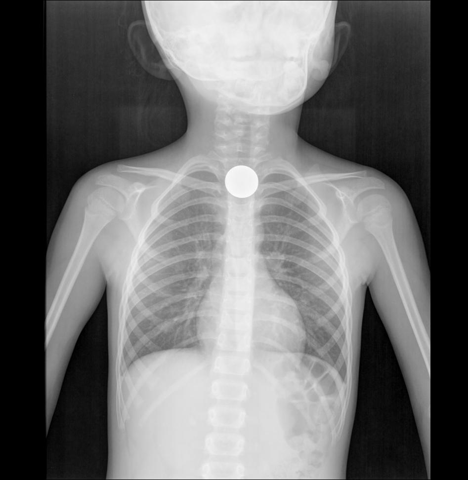
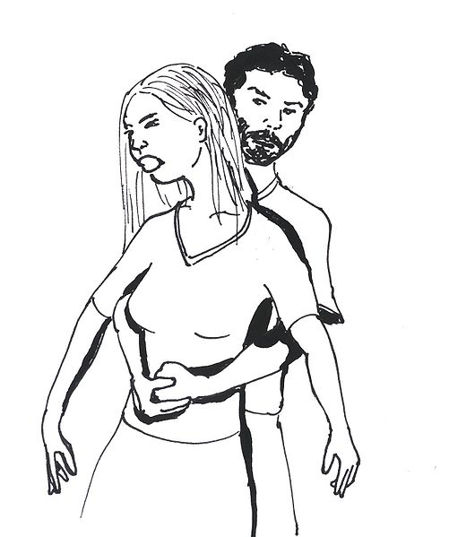

# Asfixia. Atragantamiento

 Fig.1.22. Moneda en Orofaringe.

**La asfixia por un cuerpo extraño puede ser una emergencia que amenace la vida.**

**Si un niño comienza a:**

*   Respirar agitadamente
    
*   No puede hablar, llorar, ni emitir sonidos
    
*   El rostro se le empieza a poner azul
    
*   Se sujeta la garganta
    
*   Mueve los brazos, y
    
*   Parece tener pánico
    
*   … son **indicios claros de que se está ahogando.**
    

**Se puede PREVENIR:**

*   Los niños menores de 4 años deben evitar comer alimentos con los que sea fácil ahogarse, incluyendo frutos secos, zanahorias crudas, palomitas de maíz y caramelos duros o pegajosos.
    
*   Cortar los alimentos en trozos pequeños.
    
*   Asegurarse de que los niños que se sienten a comer, tomen bocados pequeños, y no hablen o rían con la boca llena mientras comen.
    
*   Recoger del suelo cualquier objeto que parezca peligroso si se tragara, como globos desinflados, tapas de bolígrafos, monedas, joyas y baterías.
    
*   Mantener los juguetes y artefactos con partes pequeñas fuera del alcance de los niños.
    
*   Aprender cómo administrar compresiones abdominales y Reanimación Cardiopulmonar. (Tú lo aprenderás en el Módulo 2)
    

## Importante

*   Si el niño se arquea y tose pero puede respirar y hablar, las vías respiratorias no están completamente obstruidas y es mejor no hacer nada. Probablemente el niño estará bien después del ataque de tos.
    
*   Si el niño se estaba ahogando y se queda inconsciente o no respira, pide ayuda e inmediatamente después inicia las maniobras de Reanimación Cardiopulmonar
    
*   Lleva al niño al médico después de cualquier incidente mayor de ahogo, especialmente si tiene tos persistente. Si el niño tiene dificultad al respirar o al tragar, acudir al servicio de emergencias.
    

**L****lama al teléfono 112 inmediatamente**, o pedir a alguien que lo haga.

Aplica inmediatamente las **compresiones abdominales** (también conocidas como la **maniobra de Heimlich)**. **PRECAUCIÓN:** Si no se hacen correctamente, esta maniobra puede lastimar al niño.

 Fig.1.23. Maniobra de Heimlich. Rama. Wikimedia Commons. CC BY-NC-SA

**¿Cómo se hace esta maniobra?**

1.  Ponte de pie detrás del alumno, sujetándolo, pasando tus brazos bajo sus axilas, y abrazándolo completamente
2.  Coloca tus manos sobre su abdomen: una de tus manos cogiendo tu muñeca opuesta
3.  Efectúa 5 compresiones hacia arriba y atrás
4.  Repítela hasta que pueda expulsarse el objeto

## Importante

Si el niño se ha tragado un objeto que le está produciendo asfixia, **no cogerlo por la boca ni darle palmaditas en la espalda al niño**. Cualquiera de las dos puede empujar más el objeto en las vías respiratorias y empeorar la situación

