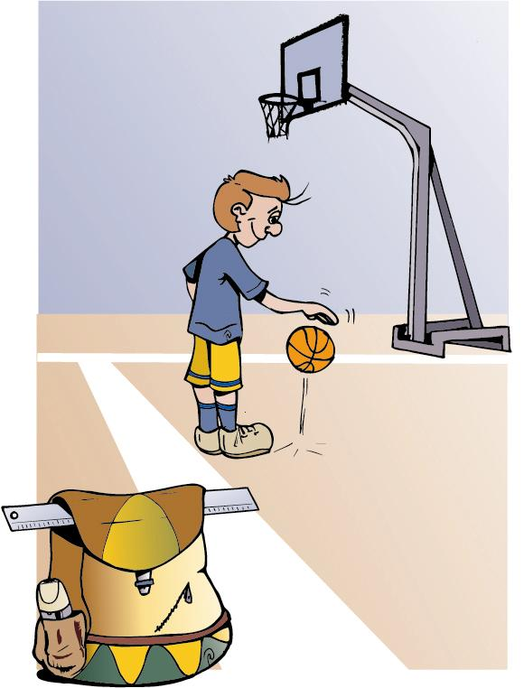

# Asma inducida por ejercicio

**El asma inducido por el ejercicio** se produce en los minutos que siguen al esfuerzo del ejercicio físico, y es transitorio. Es uno de los muchos tipos de asma que existen.

Al realizar un ejercicio que supone un gran esfuerzo, se respira por la boca y de forma más rápida, lo que implica que el aire no se ha calentado ni humedecido en las fosas nasales y llega a los bronquios frío y seco, irritando y contrayendo los bronquios.

Existen** deportes que pueden desencadenar con más facilidad síntomas de asma:**

*   Los que requieren de un esfuerzo sin descanso, ya que la actividad continua es más asmógena.
*   Carrera de fondo tipo maratón y de medio fondo (800-1500 m)
*   Ciclismo
*   Fútbol
*   Baloncesto
*   Los de ambiente frío/seco (esquí de fondo, patinaje sobre hielo...)

En cambio, **son menos asmógenos los deportes en los que hay más descansos y se corre menos:**

*   Gimnasia
*   Balonmano
*   Deportes de raqueta
*   Golf
*   Natación
*   Waterpolo
*   Yoga
*   Senderismo

**ASMA Y TIEMPO LIBRE, EXCURSIONES...**

Podéis realizar aquellas actividades de ocio que tengáis programadas en el curso gusten: ir de excursión, acudir a campamentos... evitando, siempre que se pueda, los factores desencadenantes y llevando siempre la medicación preventiva y de rescate.

Es aconsejable que si vas tú a la excursión recuerdes cómo tratar una crisis asmática, con la documentación pertinente.

