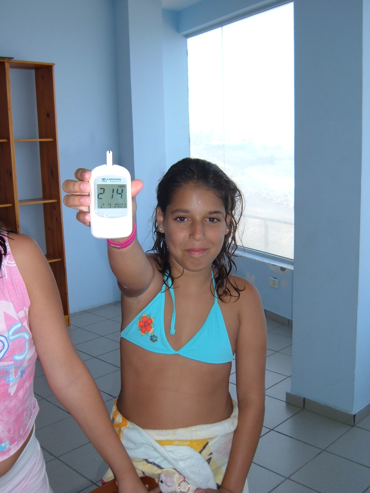
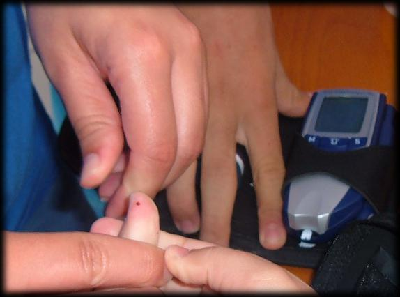

# Autocontroles

 

Seguro que tienes curiosidad por conocer en qué consiste y cómo se hace la técnica de determinación de la **glucemia capilar** (autoanálisis).

Este rápido análisis es necesario para valorar si existe un correcto equilibrio entre la dosis de insulina, la alimentación y el ejercicio físico. Por ello se realiza con frecuencia y el escolar lleva siempre consigo su medidor de glucemia (un pequeño dispositivo llamado glucómetro).

Fundamentalmente el niño hace sus autocontroles **antes de las comidas**, aunque a veces también es necesario realizarlo:

*   Después (1,5 – 2 horas) de las comidas.
*   Antes de una actividad deportiva.
*   En situaciones imprevistas (ante síntomas de hipoglucemia, en caso de vómitos, diarreas, fiebre…).

Los padres nos habrán aportado documentación sobre dónde se encuentran los utensilios necesarios para la realización del autoanálisis, así como los momentos en los que se los suele hacer.

Conviene facilitar en el centro escolar un **lugar adecuado** (limpio, discreto, cómodo) para la realización de los autoanálisis (evitar los cuartos de baño)

.

 

## Importante

*   El glucómetro mide la glucosa en sangre en unos segundos. En la actualidad se hace con una gotita de sangre que suele ser del dedo de la mano.
*   Es importante respetar la intimidad del escolar cuando realiza un autoanálisis en un lugar adecuado.

