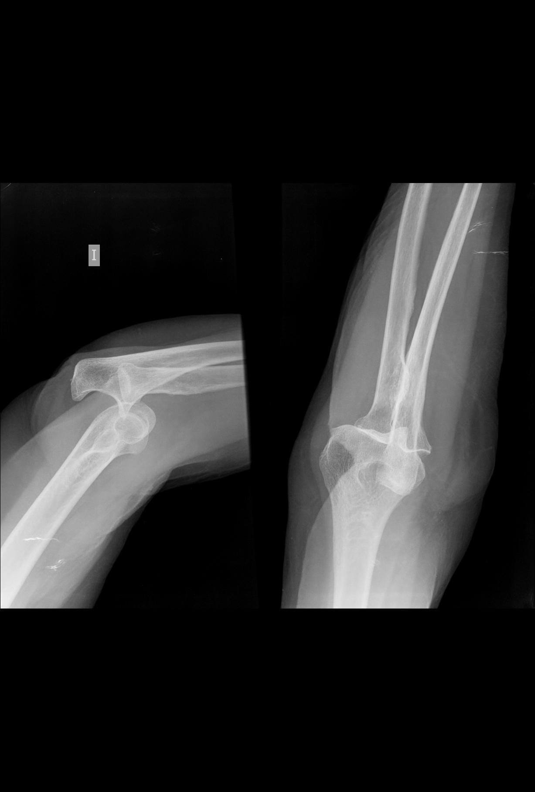
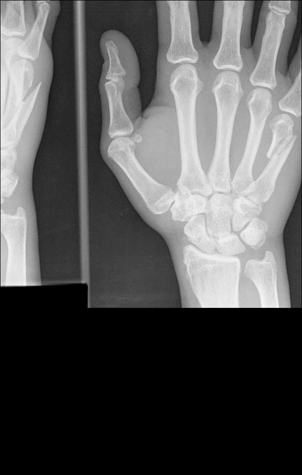

# Caídas, golpes, fracturas

 

 Fig.1.13. Luxación de codo tras caída.

Fíjate que es cerrada,

sin salida al exterior

Una **contusión** es una lesión en el cuerpo debida a un impacto sobre él. Aunque no produce lesión de continuidad, sí pueden verse comprometidas estructuras internas.

La **fractura** significa una rotura ósea, pudiendo existir varios tipos.

**Qué puedes hacer:**

*   **Contusión simple**

*   Aplica frío local, pero no hielo en contacto directo con la piel, presionando ligeramente
*   Tranquiliza al niño

*    **Traumatismo en la cabeza.**
    *   Si el **golpe** pensamos que ha sido **importante**, y llega a desmayarse el niño, sangra por la nariz u oído, vomita, tiene dolor que cabeza con carácter progresivo o muy intenso o se comporta de forma rara, avisa al 112
    *   Avisa si hay algo que te preocupa
    *   Si el golpe sólo produce un chichón, dolor local, algo de dolor... aplica frío local.
    

 

 Fig.1.14. Fractura en metacarpo tras caída

**Siempre notifícalo a sus padres**

## Importante

*   La mayor parte de los traumatismos en la cabeza sonde carácter leve, y no produce daños cerebrales, ni lesiones
*   Tras las primeras horas del golpe, es normal que el niño: se mantenga asustado y no recuerde cómo ocurrió el golpe y le duela la cabeza esté asustado, no recuerde el momento del traumatismo, tenga dolor de cabeza o presente algún vomito.

**Golpe en la zona del abdomen**

Depende de la intensidad, pero si estás preocupado, lo mejor es tranquilizar al alumno, avisar al 112 y mantenerlo mientras espera con las piernas flexionadas mirando hacia arriba

 **Fractura**

 

 Fig.1.15. Fractura. Sergio Palao. ARASAAC. CC (BY-NC-SA)

**Una fractura precisa de actuación rápida, por el riesgo de complicaciones**

*   Siempre avisa al 112 y vigila al niño (signos vitales, comportamiento...)
*   No muevas al niño
*   Trata la hemorragia cubriendo la herida con gasas estériles o paños que estén limpios, si puede ser humedecidos para que no empapen demasiada sangre
*   Aplica frío local
*   Si es una fractura abierta, no la movilices, ni intentes reducirla

## Importante

**Si la caída o golpe no produce herida:**

*   No levantes muy deprisa del suelo al niño, si se ha caído
*   Si la contusión afecta a una extremidad, elévala, retirando los objetos que haya en ella y puedan comprimir
*   Aplica frío local

Si hay algún **hematoma, no lo pinches**

**No apliques pomadas ni** le administres **fármacos** para que no le duela, ya que pueden desorientar al médico cuano le explore

