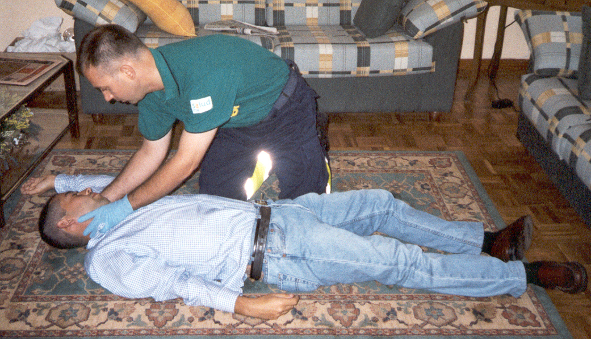

# Crisis epilépticas: actuación

 

### **Qué hay que hacer**

Te proponemos estas claves para que no las olvides:

*   No te precipites, no pierdas la calma, evita las aglomeraciones a su alrededor: has de recordar las nociones básicas de este curso y ser consciente de que dominas la situación.
*   Intenta tumbarlo sobre una superficie blanda
*   Gira con suavidad su cabeza hacia un lado, para evitar que con su saliva o algún vómito se pueda atragantar, hasta que se vuelva a la situación normal.
*   Evita que el niño se lesione durante la crisis: mediante 3 acciones:

*   *   Quita los objetos peligrosos que puede haber alrededor, (incluidas sus gafas si las lleva)
        
    *   Coloca alguna cosa blanda bajo su cabeza (una prenda de ropa puede servirte, toalla, colchoneta, etc) para que no se golpee contra el suelo
        
    *   Aflójale la ropa, fundamentalmente si le oprime el cuello
        
*   No lo agarres, no lo inmovilices por la fuerza, no interfieras en sus movimientos
    
*   No le introduzcas nada en la boca en la crisis generalizada: nada es nada, ni durante la crisis ni poco después
    
*   Mantén la tranquilidad para comprobar que la crisis ha terminado y no te separes del niño hasta entonces. Es muy raro que se prolongue más de 1-2 minutos.
    
*   Tras la crisis permítele descansar hasta que se encuentre recuperado, ya que suele entrar mucho sueño y estar desorientado.
    

**Qué NO hay que hacer**

*   Reanimación cardiopulmonar: aunque aparentemente no respire, no necesita respiración artificial. No le hagas el "boca a boca", ni nada similar. Tras la crisis recupera el ritmo normal de la respiración.
*   Abrirle la boca: no trates de abrirle la boca a la fuerza, porque os podéis lastimar los dos. Si se produjera la mordedura de la lengua en la primera parte de la crisis, sólo es un daño menor
*   Poner agua o alcohol en la frente para que se recupere durante la crisis: no sirve para nada, y si es alcohol puede entrar en los ojos y ocasionarle irritación.
*   Darle medicamentos por boca

  
**Después de la crisis, ¿qué hago?**

Puede tener dolor de cabeza, estar confuso o tener sueño, incluso molestias en los músculos, o saliva teñida de algo e sangre si se mordió una parte de la lengua, por lo que:

*   Permite que el niño descanse, y con la comprensión que te identifica como profesor, haz que el niño se tranquilice.

## Importante

Ante una crisis generalizada:

*   No coloques nada en la boca
*   Intenta tumbarlo y colócale algo blando bajo la cabeza
*   Gira su cabeza suavemente para que no se atragante
*   Retira objetos con los que se puede golpear
*   Aflójale la ropa
*   Pasada la crisis pon de lado a la persona, en la posición lateral de seguridad.

