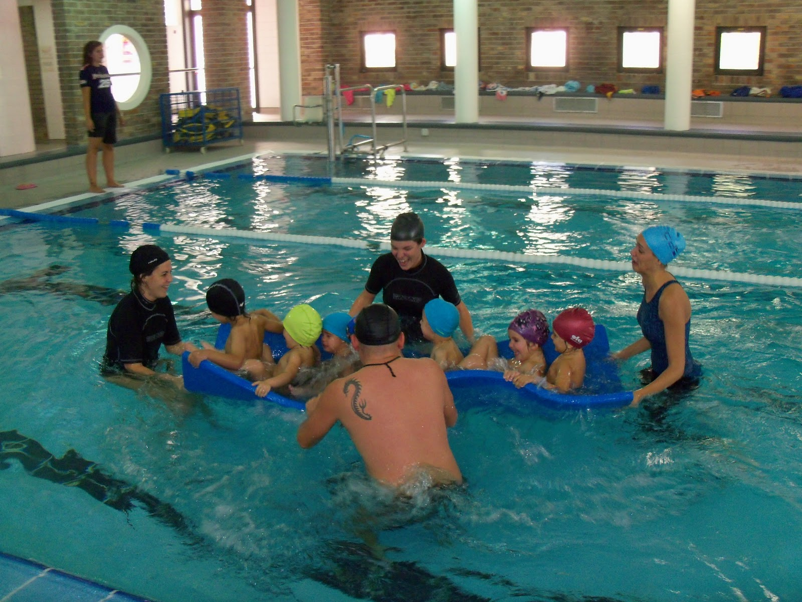

# Deporte

 Fig.3.15. CRA "Tastavins". Deporte y salud. RAEPS. 

El niño que tiene asma **puede hacer deporte** de forma habitual y no debe ser motivo para no practicarlo, incluso deporte de competición.

El mejor deporte es el que más le guste al niño asmático,con algunas precauciones, para lo que es necesario **mantener un buen control del asma** diariamente y **saber reconocer los síntomas** del asma precozmente para **evitar el desarrollo de una crisis de asma**; si ésta se desencadenara habría que tratarla rápidamente y no realizar actividad física deportiva hasta su recuperación.

El alumno con asma tiene que aprender a respirar, saber qué tipos de ejercicio le son más beneficiosos, cómo y cuándo realizarlos

### ** Lee detenidamente estos consejos:**

1.  Realizar un **calentamiento adecuado** previo al ejercicio, empezando suave, de forma progresiva y aeróbica, hasta alcanzar una actividad de intensidad baja o media en 10-15 minutos.
2.  No se recomiendan los ejercicios anaerobios de alta intensidad
3.  Recuerda que tienes que dejarle **descansar** si te lo pide por la presencia de algún síntoma (evita que te engañe si no quiere hacer deporte)
4.  Ayúdale a **saber relajarse**, como hace todo deportista
5.  Además no es bueno que pare de repente, sino mejor de una forma progresiva
6.  **Respirar por la nariz**
7.  **Adaptarse de forma paulatina**, y así poder reconocer qué síntomas son los propios del asma y cuáles los del cansancio físico intenso
8.  **Tomar la medicación** que esté indicada antes de realizar ejercicio y cuando haya recomendado su médico
9.  Si desea hacer un **deporte de competición**, infórmate bien sobre la **legislación** actualizada en el tema del dopaje, por la medicación que utiliza el niño asmático.
10.  Llevar siempre el **broncodilatador en la mochila o bolsa de deporte.**

