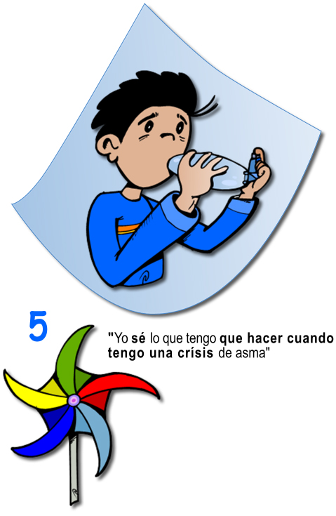

# En la escuela

 Fig.3.17. Niño con asma. Documento de salud del asma en pediatría. DG Salud Pública

Como bien sabes por tu experiencia como profesor, vas a tener un papel fundamental en la atención al alumnado con una enfermedad crónica como es el asma, para que pueda llevar una vida lo más normal posible en el centro, cumpla con sus objetivos académicos y tenga bajo control el asma.

Por eso insistimos en **facilitar la comunicación entre las partes implicadas**, que son: el alumno con esta condición de salud, sus padres, el personal sanitario responsable y tú conjuntamente con otras personas de tu colegio o instituto, además de las Autoridades Sanitarias.

En lo que respecta a su **rendimiento académico** hemos de comentarte que en determinadas circunstancias, cuando los factores desencadenantes del asma están presentes (por ejemplo en épocas de más polinización) puede ser frecuente el **absentismo escolar,** aunque si los síntomas son leves el niño asmático debería ir a clase, hecho que justifica que aprendas bien este tema para evitar el avance a una crisis o el temor a no saber cómo actuar.

Más que el asma, **son los fármacos utilizado**s los que pueden interferir en ocasiones con la concentración del joven, así como producir efectos adversos, como dolor de cabeza o temblor, que le pueden hacer perder habilidades en su escritura o dibujo.

Al igual que ocurre con la diabetes, es importante que se conozca en el centro la llamada "Ficha del niño con asma", o "**Protocolo de actuación ante el asma en los centros educativos"** que lo tienes para que la puedas consultar en su enlace correspondiente. Os la habrá entregado la familia del niño, y está rellenada por el médico responsable conjuntamente con los padres. Es fundamental para saber qué alumnos hay con asma en el colegio o instituto así como para tener información sobre la enfermedad y cómo tratarla en caso que se precise una intervención rápida. **Consúltalo:** es muy sencilla de comprender, ya que consta de 6 partes:

*   Datos del alumno
*   Paso 1: síntomas leves del asma: cómo actuar
*   Paso 2: síntomas moderados o graves del asma: cómo actuar
*   Asma inducida por el ejercicio: cómo actuar
*   Llamadas de emergencia: teléfonos
*   Autorización

Existe el llamado **"Decálogo del colegio saludable para los niños con asma"**, donde se resumen en 10 puntos los principales aspectos que debe tener el centro escolar para el normal desarrollo del niño con asma en las aulas. Es la situación ideal.

