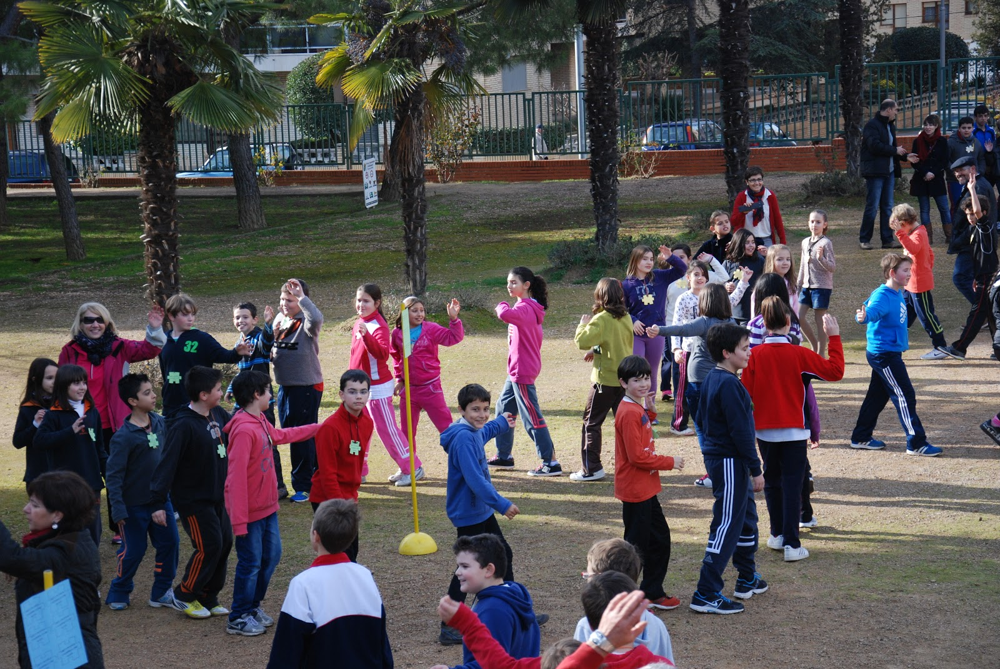

# En la escuela

 Fig.3.38. Niños jugando en patio. Colegio Pedro I (Barbastro). RAEPS

Sólo un pequeño porcentaje de niños con epilepsía tiene dificultades en el rendimiento escolar y precisan de modelos pedagógicos específicos; el resto de niños epilépticos tiene un **nivel intelectual normal**, y su rendimiento depende de la propia capacidad intelectual del joven.

**Pueden influir en el rendimiento escolar:**

*   El tipo de crisis
*   La edad de aparición (a más temprana, peor)
*   La medicación antiepiléptica (algunos fármacos ocasionan menor concentración)
*   La actitud de los padres, compañeros de clase y la tuya como profesor

La **exigencia escolar** ha de ser igual que la del resto de la clase, y no hay limitación de tiempo que esté frente al ordenador, siguiendo las **mismas recomendaciones de salud que el resto de niños,** excepto en las epilepsias fotosensibles.

Puedes explicar en la clase en qué consiste la epilepsia, para que si ocurre una crisis en tu centro no se vea como "un espectáculo" que provoque el estigma de "ser diferente", haciendo énfasis en que no es una enfermedad contagiosa ni peligrosa.

En este sentido, queremos mostraros **una de las numerosas y aplaudidas iniciativas** que en nuestra Comunidad Autónoma llevan a cabo las Escuelas Promotoras de Salud a través de la Red Aragonesa de Escuelas Promotoras de Salud (RAEPS), utilizando el material de la campaña divulgativa **"Conocer la epilepsia nos hace iguales", material íntegro de carácter nacional **que os ofrecemos entre los recursos.

  
**Actividad física y deporte**

**El niño con epilepsia puede y debe realizar deporte,** además de por todos sus beneficios, **porque disminuye la posibilidad de tener una crisis epiléptica y tiene un efecto protector.**

Como norma del sentido común, **hay deportes menos recomendados** como el buceo y submarinismo, los que necesitan vehículo a motor, la escalada... **Otros,** como la natación **precisan de vigilancia,** o el ciclismo (por el resto de vehículos).

Por eso es fundamental la relación con los padres y el sistema sanitario para conocer todas las recomendaciones que, de forma fluida, pueden ayudarte.

## Importante1

El niño que tiene epilepsia tiene un nivel intelectual normal en la mayoría de los casos

Debes exigirle académicamente lo mismo que a sus compañeros de clase

Cuanto más sepas sobre la epilepsia, más tranquilo estarás, vencerás tus posibles miedos y podrás ayudar al niño a mejorar su calidad de vida

El niño que tiene epilepsia puede y debe realizar deporte

