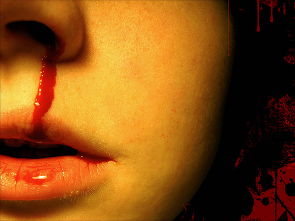
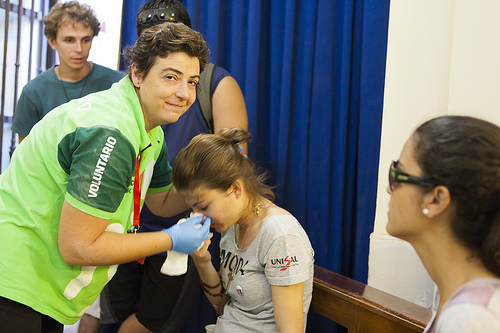

# Hemorragia

 

 Fig.1.10. Hemorragia nasal. Eɳcɑɳto. Foter.com. CC (BY-NC-SA)

**La hemorragia es** la salida de la sangre por un vaso sanguíneo debido a su rotura, y puede ser interna (no sale del organismo) o externa (sale fuera de la piel)

**Se producen por varias** causas, siendo las más frecuentes:

*   Caídas
*   Cortes y heridas
*   Golpes, traumatismos

## Importante

La gravedad de una hemorragia se determina por la cantidad de sangre que se pierde

**Lo que tienes que hacer es:**

*   Tranquilizarte tú, y tranasmitir esa calma al niño
*   Haz que el niño no se mueva, para que con el movimiento no se pierda más sangre
*   Utiliza guantes
*   La presión sobre la herida hará de tapón, impidiendo la mayor salida de sangre
*   Si es **por una herida externa:**
    *   Puedes limpiarla con cuidado con suero fisiológico
    *   Sécala con una gasa estéril, sin frotar: presiona
    *   Utiliza una solución antiséptica tipo Clorhexidina 0,05%
    *   Tápala con una gasa estéril y esparadrapo
    *   Si ves que continúa sangrando haz presión sobre la gasa
*   Si es una **hemorragia nasal:**
    
    *   Presiona el orificio de la nariz que sangra
        
    *   Inclínale la cabeza ligeramente hacia delante
        
    *   Si el sangrado continúa, coge una gasa estéril e introdúcela empapada en agua oxigenada por el orificio lo máximo que puedas (para que ejerza presión). Ten precaución en dejar parte de la gasa fuera para poder extraerla más tarde.
        
    *   Si sigue sangrando, informar a los padres y que el niño reciba asistencia sanitaria
        

 

 Fig.1.11. Presión en nariz con hemorragia.

Madrid2011jmj. Foter.com. CC (BY-NC-SA)

*   Si es una herida que penetra en **tórax o en abdomen**
    
    *   Cubre la herida con gasas ejerciendo presión y avisar al 112
        
    *   Vigila en todo momento los signos vitales del niño
        

## Importante

*   Si utilizas una gasa para tapar una herida que sangra, y a pesar de eso la gasa se empapa de sangre, no retires esta gasa: pon otra encima y continúa haciendo presión
*   En la hemorragia nasal no inclines la cabeza hacia detrás, ni subas el brazo que corresponde al lado del orificio que sangra

**Lo que no es recomendable que hagas es:**

*   Utilizar algodón para frenar la hemorragia
*   Usar alcohol o colonia
*   Extraer un objeto punzante si está clavado produciendo la herida

