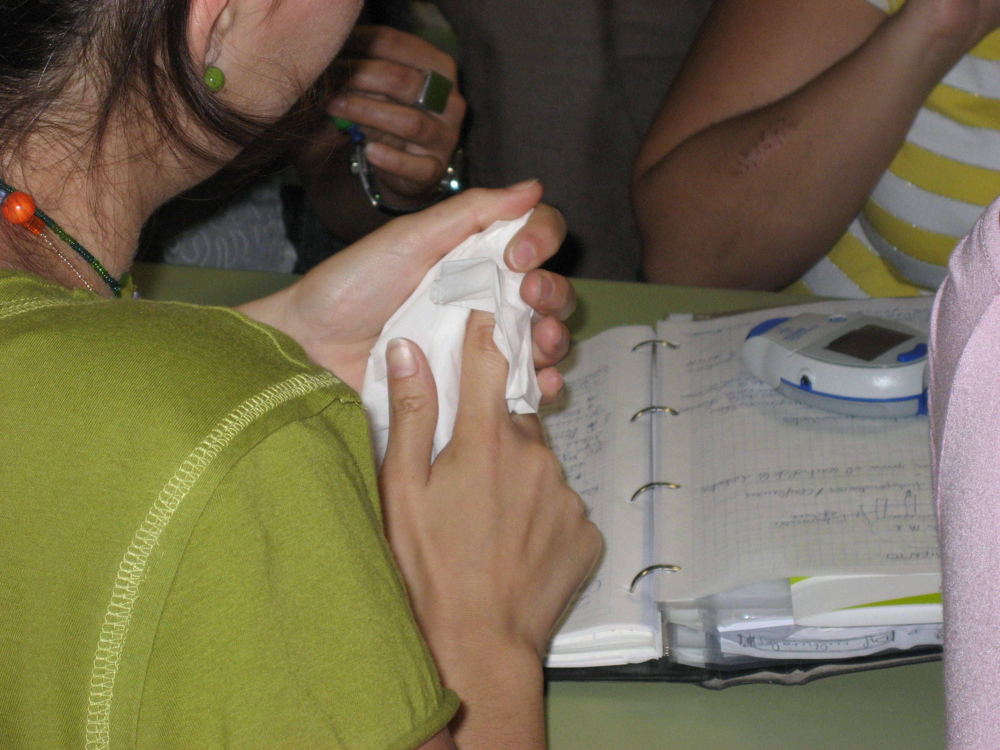

# Módulo 3. Atención al alumnado con enfermedades crónicas

  

### **Introdución**

Este módulo supone una **importante carga docente** en el curso por dos motivos:

*   El primero, **acercarte a las enfermedades crónicas no transmisibles** por la elevada prevalencia que actualmente tienen en nuestro país **y entenderlas,** para saber cómo se producen, qué complicaciones agudas pueden tener y cómo se pueden prevenir, o en su defecto tratar en el ámbito escolar.
*   El segundo, **comprender al alumno** que tiene esta condición de salud que en el momento actual no tiene cura para **ayudar a su integración** en la escuela y la sociedad en general.

No es raro que tengas un alumno con asma, alergias, diabetes o algún tipo de cáncer en tu clase durante algún curso académico, y seguramente sientas miedo a no **saber cómo actuar si te necesita**, ya que para él eres una pieza fundamental en su vida, sabemos que eres consciente de ello.

**Imagínate a una niña con asma** que en un día de septiembre, en el recreo, empieza con unos síntomas, y que al verlos ya identificas que le puede aparecer una crisis (tos, pitidos, dificultad para respirar), por lo que intervienes rápido para que se tome la medicación, que ella muy bien sabe cómo, y puedes ayudar a evitar una crisis de asma que la va a perjudicar.

**Este módulo te será muy útil** porque te sentirás capaz a hacer lo que hasta estos momentos tenías más temor, debido a la poca información que tenías.

Te aconsejamos el **visionado del numeroso material multimedia,** que te ayudará a comprender la mayor parte de los contenidos.

https://youtu.be/UZVLFpWDhoM

## Objetivos

**Tras haber finalizado este módulo, estarás capacitado para:**

1.  Conocer en qué consisten las enfermedades crónicas que has estudiado: Alergias e intolerancias, Asma, Cáncer, Cardiopatías, Diabetes y Epilepsia.
2.  Saber actuar ante las situaciones en las que se requiera tu actuación urgente
3.  Comprender la situación del niño que tiene una condición de salud crónica y ayudar a integrarlo entre sus compañeros, a través de su bienestar emocional.

