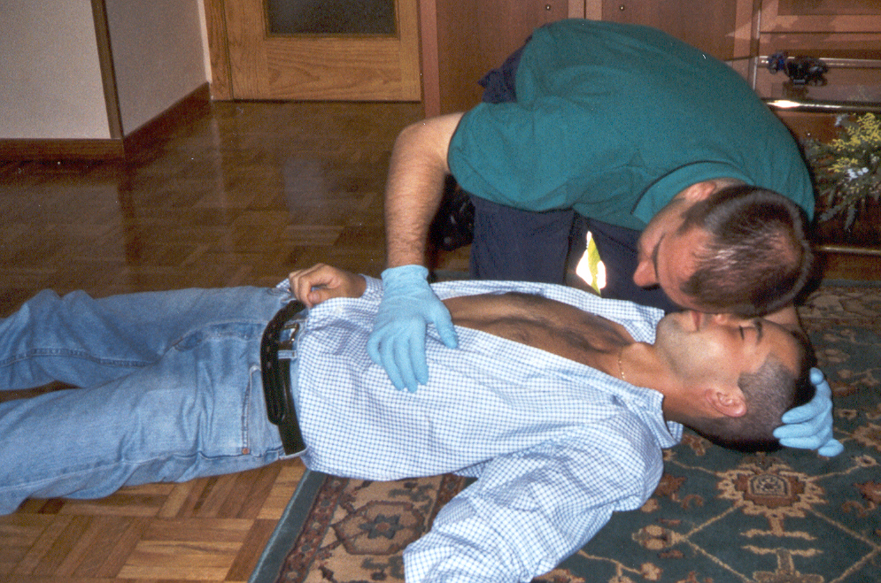
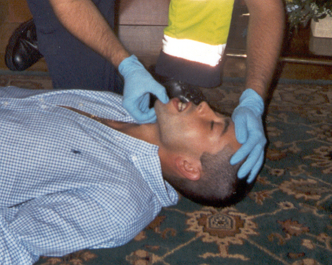
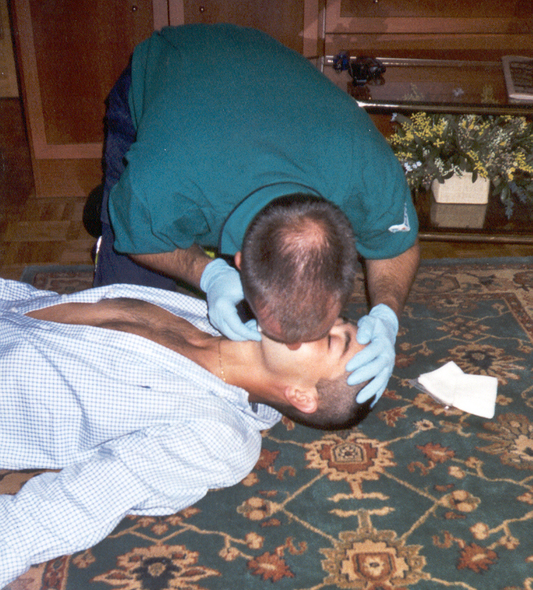

# Pasos secuenciales

 

**1º Conseguir la seguridad de ti como reanimador y del niño.**

*   Se debe de movilizar al niño sólo si se encuentra en un lugar peligroso o si su posición no es adecuada para la reanimación.

**2º Comprobar la conciencia. ("A" del ABC)**

*   Se estimula al paciente hablándole, con pequeños pellizcos o sacudidas (salvo sospecha de lesión cervical).
*   **Si el niño responde** moviéndose o hablando se le deja en la posición en que se encuentra si no corre peligro. Se controla periódicamente y se solicita ayuda si es preciso.
*   **Si no responde** se continua el siguiente paso de la Reanimación cardiorespiratoria (RCP) básica.

**3º ¡Pedir ayuda!**

Sólo se solicita ayuda si es posible sin abandonar la asistencia del pequeño. Las maniobras de RCP deben comenzar de forma inmediata, sin pérdida de tiempo, pues los lactantes y niños muchas veces solo precisan las maniobras de reanimación respiratoria.

**4º Apertura de la vía aérea.**

Un niño inconsciente suele ser incapaz de mantener abierta y permeable la vía aérea por lo que la primera medida a tomar es la apertura de la vía aérea con las siguientes maniobras:

 

*   **Maniobra frente-mentón:**
    *   Se coloca una mano sobre la frente, realizando una extensión moderada del cuello en niños y neutra en lactantes, y con la punta de los dedos de la otra mano se levanta el mentón. Se debe evitar cerrar la boca o empujar los tejidos blandos debajo del mentón.

*   **Tracción de la mandíbula:**
    *   Se efectúa esta maniobra si se sospecha traumatismo craneocervical, donde la maniobra frente-mentón esta contraindicada.
    *   Como reanimador, traccionas la mandíbula hacia arriba, teniendo cuidado de mantener inmovilizada la columna cervical con alineación de cabeza-cuello.
    *   La maniobra consiste en tirar hacía arriba de la mandíbula con una mano mientras se sujeta la cabeza con la otra para impedir que la columna se desplace en cualquier dirección.

**5º Comprobar la respiración. ("B" del ABC)**

Mientras mantienes la postura de apertura de vía aérea con ambas manos, acerca su cara a la mejilla del niño y notarás la columna de aire sobre tu propia mejilla, escucha los ruidos respiratorios y observa si existe movimiento torácico y abdominal en la víctima.

*   **Si el niño respira,** se le coloca en posición de seguridad, salvo si existe sospecha de lesión cervical.
*   **Si el niño no respira** y hay evidencia o sospecha de obstrucción de vía aérea, se procede a realizar las maniobras de desobstrucción de la misma.
*   Si no respira, se procede a ventilar.

 

**6º Ventilación.**

Manteniendo las manos sobre la frente y mentón, para conseguir una buena columna de aire, se realizan **5 insuflaciones seguidas** con el aire espirado del reanimador.

*   Si se esta reanimando a un **lactante,** se debe abarcar la boca y nariz del paciente con la boca del reanimador. 
*   Si se trata de un **niño mayor,** la ventilación se realiza boca a boca pero sellando los orificios nasales con los dedos.

Mientras se realizan estas primeras insuflaciones, se debe de observar como asciende y desciende el tórax. Las insuflaciones deben de **ser lentas (1 a 1.5 seg.)**, observando la expansión del tórax mientras se ventila.

**Si el tórax no se mueve o muy poco, debemos:**

1.  Abrir la boca y eliminar cualquier cuerpo extraño que haya.
2.  Asegurar que la maniobra frente-mentón se realiza correctamente.
3.  Volver a insuflar 5 veces y si no se consigue la expansión torácica esperada, se debe de tratar como una obstrucción por cuerpo extraño.

**7º Comprobar pulso. ("C" de circulación)**

Después de las 5 primeras insuflaciones, se comprueba la existencia de pulso arterial durante un máximo de 10 segundos:

**-Pulso carotídeo en niños.**

La técnica es igual a la realizada en el adulto.

*   **Si hay signos de circulación, **se debe continuar ventilando a una frecuencia de 12 a 20 veces/min (de mayor a menor frecuencia desde el lactante a la pubertad), hasta que el niño respire por sí mismo con eficacia.
*   **Si no hay signos de circulación**, no hay pulso arterial central o la frecuencia del pulso es inferior a 60 lat./min a cualquier edad y se acompaña de pérdida de consciencia, ausencia de respiración y mala perfusión periférica se debe efectuar masaje cardíaco
*   ** Si el niño respira,** pero esta inconsciente se coloca en posición de seguridad.

