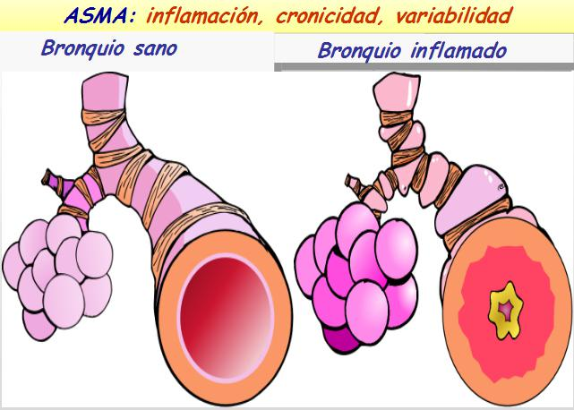

# Qué es el asma, causas, síntomas

 

Tienes que saber del asma que es una enfermedad respiratoria crónica, caracterizada por una **inflamación de los bronquios**, lo que provoca que se estrechen con facilidad, y **se dificulte el paso de aire a los pulmones**, con lo que la persona respira peor.

Por la inflamación crónica, **los bronquios son muy sensibles y reaccionan** ante muchos estímulos desencadenantes, como el humo del tabaco, pólenes, ácaros, infecciones respiratorias... los bronquios se siguen estrechando de forma rápida, y producen una crisis de asma.

**El asma no es una enfermedad infecciosa,** no se contagia, y se caracteriza por unos síntomas que debes conocer, y que estamos convencidos que vas a recordar siempre.

### **Síntomas del asma**

El asma tiene unos síntomas que pueden ir de los más leves a los graves. Si conoces a un niño con esta enfermedad (asma infantil) verás que tiene **episodios con estos síntomas típicos:**

*   De mayor o menor **dificultad para respirar**
*   **Tos,** que suele ser seca al principio, y luego pasa a ser productiva, húmeda, porque arrastra mucosidad producida en los bronquios
*   **Sibilancias (pitos)**, semejantes a silbidos, producidos al pasar el aire por los bronquios estrechados
*   **Fatiga** y sensación de opresión en el pecho en los más mayores.

Además de estos signos y síntomas podrás encontrar en muchas ocasiones picor de nariz, estornudos, conjuntivitis...

La **presentación del asma** puede ser de forma variable:

*   Como episodios agudos repetidos (crisis de asma)
*   Como una tos que persiste durante mucho tiempo (por las noches, con el ejercicio…)
*   Pueden existir largos periodos libres de síntomas

Estos síntomas **no son exclusivos del asma**, pero lo que sí **es típico es que aparezcan la dificultad para respirar (disnea), la tos y las sibilancias al mismo tiempo, y de forma repetida.**

 Te aconsejamos que aprendas a reconocer los primeros síntomas por si es preciso prevenir una crisis de asma.

