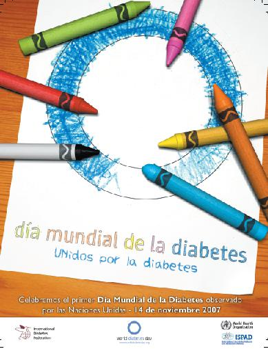

# ¿Qué es la diabetes?

 Fig.3.25. Cartel día mundial diabetes. IDF. Licencia CC (BY-NC-SA)

 La diabetes es una **enfermedad crónica** que en la actualidad no tiene curación, y se caracteriza por un **aumento de las cifras de glucosa en sangre. **Es una de las enfermedades más frecuentes en la edad escolar.

**La diabetes tipo 1** es la típica de los niños y adolescentes y se debe a una falta de la hormona liberada por el páncreas llamada insulina. La causa de este tipo de diabetes es autoinmune, y supone una destrucción selectiva de las células que producen esta hormona.

**La diabetes tipo 2** aparece frecuentemente en las personas mayores de 40 años de edad, y se relaciona con la obesidad, por eso este tipo de diabetes ha empezado a diagnosticarse en los jóvenes obesos.

**El tratamiento en la infancia y adolescencia precisa de la inyección de insulina y del control adecuado de la alimentación y ejercicio físico.**

La **insulina** disminuye el nivel de la glucosa en sangre. Debe inyectarse varias veces al día, habitualmente antes de las comidas principales, en función de la cantidad de alimentos y de los niveles de glucosa.

El **logo** del día mundial de la diabetes es el **aro azul,** al igual que el lazo rosa sirve para concienciar sobre el cáncer de mama.

## Importante1

*   El niño con diabetes debe tratarse de igual modo que el resto del alumnado, integrándose en todas las actividades escolares.
*   La característica fundamental de una diabetes no tratada es la elevación de la glucosa en sangre (hiperglucemia), que si no se controla de forma adecuada puede tener graves consecuencias.
*   La diabetes típica de los niños es la tipo 1 y su tratamiento es mediante la administración de insulina.
*   El diálogo e intercambio de información entre la familia y el profesorado es fundamental para el control y tratamiento de la diabetes en el escolar.

