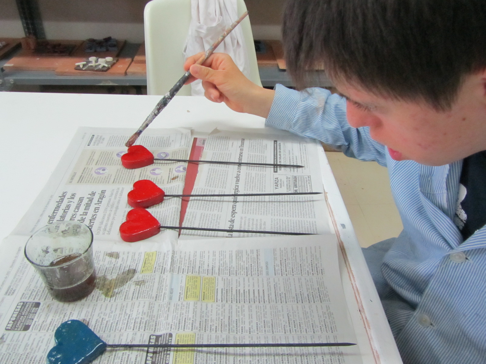

# Qué son las cardiopatías congénitas

 

 Fig.3.19. Colegio "La Alegría". Taller de corazones. RAEPS  

Son un grupo de enfermedades que se caracterizan por **malformaciones en la estructura del corazón.**

Se producen por defectos en su desarrollo durante la gestación.

 Su **frecuencia** es de aproximadamente 8 casos por cada 1.000 recién nacidos vivos en España. Gracias a los inumerables avances científicos más del 85% de los niños con esta enfermedad sobreviven hasta la edad adulta.

 Existen **más de cincuenta tipos diferentes de cardiopatías congénitas.** Increíble que haya tantos ¿verdad?

Pueden **clasificarse** en:

*   Unas que producen, por ejemplo, el paso de la sangre entre las aurículas, o entre los ventrículos.
*   Las que generan obstrucción al flujo de la sangre
*   Aquéllas que alteran la circulación fisiológica de la circulación sanguínea y hacen que la sangre no llegue con suficiente oxígeno a los tejidos y suelen provicar un color azulado en los labios y bajo las uñas, que es lo que habrás oído alguna vez definido como cianosis.
*   Otras, como la alteración en la formación de las válvulas, del funcionamiento del sistema eléctrico del corazón...

Al tener una clasificación tan amplia, ocurre igual con sus **síntomas** (algunas son asintomáticas y otras tienen síntomas severos) y **tratamiento** (unas no requieren un tratamiento específico y otras necesitan de tratamiento quirúrgico, incluso en varias ocasiones), por lo que los niños cardiópatas no tienen un tratamiento igual.

 Es importante que sepas que existen **soplos** del corazón que son normales o también llamados "inocentes", sin implicaciones negativas, ya que no todos los soplos son debidos a una cardiopatía congénita.

Aunque parece complejo, **la vida del escolar con una cardiopatía no altera el funcionamiento de la clase.**

## Importante

*   La mayoría de los niños con cardiopatía pueden llevar a cabo una vida normal, por lo que el trato en el entorno escolar ha de ser como el ofrecido a los demás niños.
*   Algunos niños cardiópatas, por sus limitaciones físicas, pueden precisar de pequeñas adaptaciones curriculares.
*   La escuela es uno de sus principales pilares, por lo que evita la sobreprotección, con el fin de favorecer su integración.

