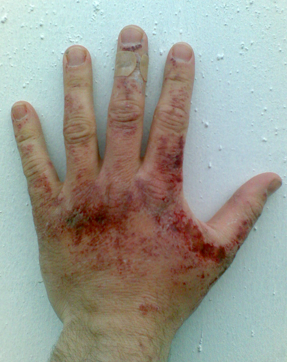

# Quemaduras

**La quemadura es** la lesión producida en el organismo por la acción del calor

**Se puede clasificar** según el agente que la origina:

*   Solar
*   Fuego
*   Inhalatoria
*   Eléctrica
*   Rayo o fulguración

  
**Otra clasificación** de las quemaduras es atendiendo a su **grado de afectación:**

*   **1º grado:** se caracteriza por la aparición de un eritema (enrojecimiento de la piel), que suele ser doloroso.
*   **2º grado**: se caracteriza por la aparición de una ampolla o flictena. Es dolorosa.
*   **3º grado:** se caracteriza por la aparición de una escara de necrosis. No es dolorosa.

>**danger**
>
>## Importante
>
>Una quemadura de tercer grado ( profunda e indolora), es extensa o afecta a orificios naturales, manos, cara, cuello, pliegues del codo o de la rodilla, genitales o planta del pie necesitan  siempre de valoración y atención médica

**Qué debes hacer inicialmente:**

1.  **Elimina la causa** que la ha originado.
2.  Lo más adecuado sería **quitarle**, en caso de que sea necesario, la **ropa** que lleve en la zona quemada, **anillos** u otros objetos, **siempre que la piel no se haya roto**
3.  Enfriar la quemadura:dejar correr el agua fría durante unos minutos (10-20)
4.  También se pueden utilizar compresas frías o cualquier sistema que enfríe el área.
5.  Cubrir con una compresa húmeda.

 Valoración por el médico.

**Lo que no debes hacer es:**

*   No se debe poner hielo.
*   No aplicar cremas ni otras sustancias.
*   No despegues la ropa de la piel, si está adherida  a ella
*   No rompas las ampollas, en el caso de que haya aparecido alguna sobre el eritema

