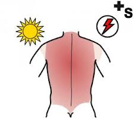

# Tipos y actuación

 

 

**Quemaduras eléctricas:**

1.  Valoración médica siempre de inmediato. **La gravedad de la lesión interna no se corresponde con la lesión externa.**
2.  Si el alumno está en contacto con la red eléctrica: separarla de la misma con un objeto no conductor (madera).
3.  Explorarlo: aplicar medidas de soporte vital indicadas:(las aprenderás en el Módulo 2)
    1.  Inconsciente con funciones vitales preservadas: posición lateral de seguridad.
    2.  Funciones vitales alteradas: maniobras de Reanimación 

>**danger**
>
>## Importante
>
>*   Si el niño no se puede desconectar de la corriente eléctrica no lo toques directamente, porque la descarga eléctrica te afectaría a ti también
>*   Puedes intentar separarlo con algún material de madera o goma.
>*   Tú puedes aislarte si tus zapatos son de goma, o te puedes subir en una superficie de madera

**Quemaduras inhalatorias:**

Propias del contacto con un ambiente de humo (incendio).

*   Se aprecia hollín en cara y el vello nasal afectado.
*   Suele haber tos con expectoración negruzca.

**Qué debes hacer:**

1.  Son **quemaduras graves** que pueden comprometer la vida por inflamación del árbol respiratorio.
2.  Necesitan **asistencia médica siempre,** para que pongan oxígeno y trasladar urgentemente al niño a un centro hospitalario.

**Quemaduras químicas:**  
Producidas por el contacto de la piel o mucosas con una sustancia cáustica.

**Qué debes hacer:**

*   Precisa siempre de una valoración médica urgente
*   **Regla de los “15”**:
    *   Enfriar con agua a unos 15º
    *   durante 15 minutos
    *   a una distancia lesión-agua de 15 cm.
    *   Tapar con compresa húmeda.

**Quemaduras por el rayo:**  
Son quemaduras muy similares en cuanto a gravedad y actuación que las eléctricas.

**El rayo es** una corriente eléctrica continua y directa, de corta duración y alto voltaje, pero has de tener en cuenta que cerca del 70% de las fulguraciones no son fatales, sino que pueden producir numerosas lesiones, entre las que están las quemaduras.

Es importante que sepas actuar para prevenir esta situación, porque l**as lesiones por rayos son evitables** tomando las precauciones debidas: meteorológicas, de resguardo y de cómo actuar en zonas abiertas.

https://youtu.be/FZOWFi9N3DI
  

