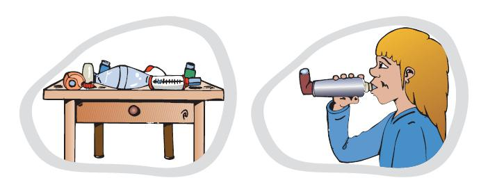
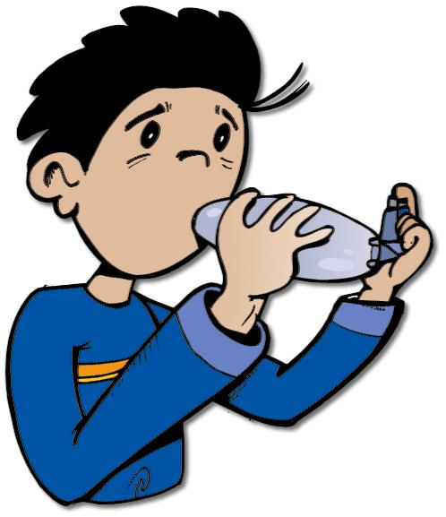

# Tratamiento

 Fig.3.12. Asma. Documento de Asma en Pediatría. DG Salud Pública

**1\. Medidas higiénicas**

Alejar al niño de la fuente de alérgenos, respirar por la nariz para calentar y limpiar el aire, realizar ejercicio físico con las recomendaciones oportunas, usar mascarilla en ciertas ocasiones, etc

**2\. Farmacológico**

Siempre es “a medida”, es decir, dependiendo de la gravedad. **Hay 2 tipos fundamentales de medicamentos**

*   **Los que alivian los síntomas**, dilatando los bronquios que están estrechados: son los **broncodilatadores, o de rescate**. Se utilizan en las crisis y en caso de tener síntomas de forma esporádica.
*   **Los que controlan la enfermedad** disminuyendo la inflamación de los bronquios: son los antiinflamatorios o preventivos. Se utilizan según la gravedad del asma y el grado de control conseguido. Cuando están indicados, hay que seguir tomándolos aunque ya no se tengan los síntomas.

 Fig.3.13. Tratamiento de asma. Documento de Asma en Pediatría. DG Salud Pública  

Para llevar a cabo el tratamiento por vía respiratoria se utilizan unos **dispositivos o inhaladores** que que permiten que pequeñas dosis de fármaco actúen de forma directa en los bronquios, y produzcan menos efectos secundarios. Es importante aprender a realizar una correcta **técnica de inhalación del medicamento**, porque si no el tratamiento es ineficaz.

**1\. Tratamiento preventivo:** sirve para disminuir la inflamación de los bronquios, y así controlar la enfermedad.

Los medicamentos que podemos usar son:

*   **Corticoides Inhalados:** producen una disminución de la inflamación del bronquio administrándolos de forma inhalada.
*   **Antileucotrienos:** producen una disminución de la inflamación del bronquio administrados de forma oral.
*   **Broncodilatadores de larga duración:** producen una relajación de los músculos de los bronquios, de unas 12 horas de duración. Se administran asociados a los corticoides inhalados. Controlan los síntomas durante el día y la noche.
*   **Inmunoterapia** o vacunación contra alguno de los factores desencadenantes puede ayudar.
*   Estos fármacos han demostrado un beneficio en la calidad de vida del asmático, ganando salud al no perder clases, ser más activos en sus relaciones sociales, aumentar su bienestar emocional...

**2\. Tratamiento de rescate:** sirve para **aliviar los síntomas de forma casi inmediata**, al relajar la musculatura situada alrededor de los bronquios y aumentando su diámetro. Estos fármacos sólo se toman si es necesario (cuando aparecen los síntomas o de forma preventiva en el asma inducida por el esfuerzo). El niño debe llevar estos fármacos consigo (colegio, excursiones...) ya que son la base del tratamiento de la crisis asmática. Suelen ser de color azul o gris.

Los medicamentos que podemos usar son:

*   **Broncodilatadores de acción rápida y corta duración:** producen una relajación de los músculos de los bronquios y se administran de forma inhalada. El número de pulsaciones dependerá de la intensidad de la crisis y de la respuesta a la medicación.
*   **Antiinflamatorios orales:** producen una disminución  de la inflamación de los bronquios y se administran por vía oral o inyectándolos. Como su efecto tarda unas 4 horas en aparecer, se usan con los broncodilatadores de acción rápida. Sólo se usan Se indican si la crisis no mejora suficientemente con el inhalador o si la crisis es moderada o grave.

