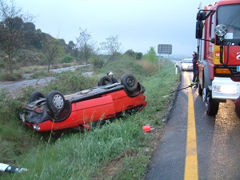

# U1. Accidentes

 Fig.1.2. Accidente de tráfico.

Tal y como te hemos dicho, actualmente **los accidentes en la infancia** son muy frecuentes, y en muchas ocasiones **pueden tener graves consecuencias** en la salud y bienestar emocional del niño.

**Como profesor** tienes que contribuir en tu centro escolar a **favorecer un ambiente seguro** a los alumnos, eliminando peligros, educando en el desrrollo de habilidades y formándote como lo estás haciendo ahora para desarrollar capacidades en la actuación rápida dentro de este contexto.

Conforme la autonomía del niño crece, incrementa las relaciones con su entorno y accede a más lugares y objetos, valorando poco el peligro; por eso en el **colegio** y en la **casa familiar** es donde **más se producen los accidentes.**

**En la escuela** los **accidentes se relacionan según la edad:** los alumnos más mayores tienen más accidentes cuando hacen deporte, y los menores, en el recreo y en las zonas de juego. Por eso tendrás que estar atento en estos lugares.

Recuerda la última vez que actuaste para ayudar a un niño en uno de los siguientes accidentes: Accidentes en los ojos, Heridas,ontusiones, fracturas, Convulsiones, Dolor Abdominal, Hemorragia, Quemaduras por calor, químicas, eléctricas, rayo, Hipertermia e insolación, Traumatismo en la boca y dientes, Intoxicaciones... ahora sabrás qué tal lo hiciste, ya que son parte de los contenidos que vamos a estudiar, y podrás adquirir muchos más conocimientos.

Te animanos a comenzar...

