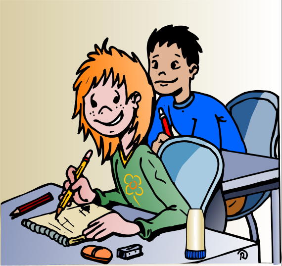

# U2. Asma

 Fig.3.9. Alumna con asma en clase. DG Salud Pública

Tienes que saber que **el asma es la enfermedad infantil crónica más frecuente** en los países industrializados, y por lo tanto en España, donde entre un 3% y un 7% de la población adulta tiene esta enfermedad, cifra que sube hasta situarse entre un 5% y un 10% en los niños menores de 6 años. En cifras generales, más de 1 millón de menores de 18 años en España tienen asma.

El asma implica a todos los elementos de la comunidad educativa, además de a los profesionales sanitarios. Al ser una enfermedad muy frecuente, que actualmente no tiene curazón, con causas multifactoriales, **puede necesitar de tus conocimientos** para que sepas **hacer lo posible en la prevención y en la ayuda al tratar una crisis asmática**, así como ayudar en la **integración** plena del niño asmático, por eso queremos presentarte este tema con el máximo interés.

**En el contenido de esta unidad ****verás** qué es, cómo se produce y cuáles son los factores desencadenantes del asma, el conocimiento rápido de sus síntomas de alerta, los medicamentos que se administran para prevenirlo y para aliviarlo (así como su forma de administración) y la situación del niño asmático en el centro educativo, integrado como un niño más, para satisfacer sus necesidades sociales y educativas.

**Queremos que te sientas bien entendiendo ****las causas** que provocan una crisis de asma, los síntomas que te avisan, y **cómo tienes que actuar** si en la clase, en el recreo, en una excursión... se desarrolla una crisis, así como realizando una labor de **integración efectiva del niño** entre sus compañeros.

Te ofrecemos **numerosos recursos** a través de enlaces para descargarte materiales educativos y material audiovisual, para ayudarte en tu estudio y para utilizarlos en el aula.

**Es una de las unidades más sencillas** de este módulo, por lo que te deseamos que la disfrutes. ¿Empezamos?

