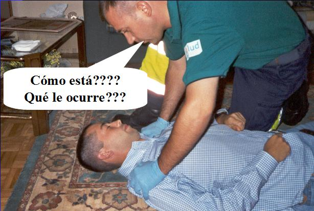

# U2. Primeros auxilios

Los primeros auxilios **consisten** en prestar asistencia necesaria a una persona que lo precisa por estar afectada su salud de forma repentina, o que sufre un episodio de urgencia.

Sabemos que **tú como profesor** en no pocas ocasiones te has visto o te podrás ver implicado en una situación en la que se requiera de **tu actuación** en primer lugar, tanto **de tipo emocional como físico.**

La secuencia de actuación en Primeros auxilios se basa en la **Regla "PAS",** de forma que sería:

P = Proteger al alumno que necesita ayuda

A = Avisar al 112 ( o en su caso al teléfono de información toxicológica ¿lo recuerdas?

S = Socorrer, una vez hecho lo anterior se puede iniciar la secuencia de primeros auxilios

**La asistencia inicial** se expresa con otra expresión, que es el **"ABC",** que te servirá para priorizar tus acciones ordenando los pasos a seguir:

A = de Alerta o Consciencia

B = respira bien

C = circulación de la sangre

**Es fundamental recordar el orden de la actuación**

