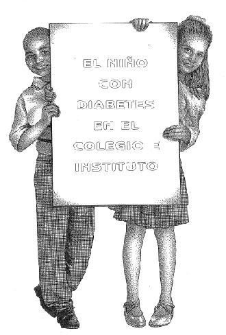
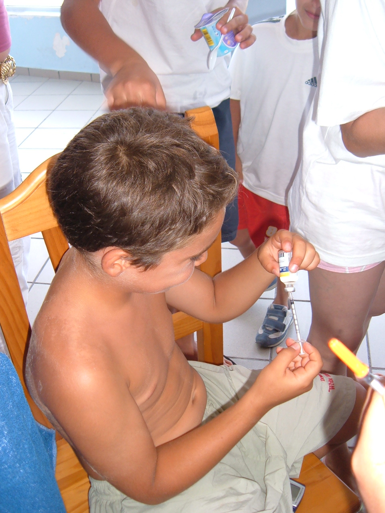

# U4. Diabetes

 Fig.3.23. Niños unidos contra la diabetes. 

Como docente, y si llevas algún tiempo dedicándote a trabajar entre niños o adolescentes habrás descubierto, a menos que durante tu formación hayas tenido excelentes maestros, el elevado número de veces que el desarrollo "normal" de la clase se ve interrumpido por toses, estornudos, vómitos e incluso desvanecimientos de los alumnos, amén de los accidentes que pueden darse por ingerir lo que no se debe, tocar donde no hay que tocar, etc.

Los docentes, en medio de este cúmulo diario de dificultades, tenemos como otra más la presencia del alumno diabético, y como buenos profesionales hemos de saber cómo actuar ante un eventual problema ya que en algunos casos nuestra actuación será decisiva.

Como primera medida, y si no lo has hecho hasta ahora, hazlo, descubre quiénes son tus alumnos con esta dificultad. Y digo descubre porque a una pregunta directa al alumnado puede que no lo averigües ya que algunos no se atreverán a decirlo delante de sus compañeros. Aquí los padres son nuestros grandes aliados, y en las reuniones de los equipos educativos es un punto a considerar de las características individuales de nuestros alumnos.

Pero, ¿qué pequeñas e importantes cosas suceden en torno al colegial o al alumno de instituto? Veamos algún ejemplo y juzga tú mismo.

Nuestro alumno decide en clase que debe hacerse una medida de glucosa. Ni corto ni perezoso saca una aguja, se da un pinchazo en el dedo, provoca una gota de sangre y la coloca después de algunas maniobras en un ingenioso aparatito similar a una calculadora digital a la espera de obtener una cifra. Todo ello con la curiosidad natural de los compañeros que le rodean y, mientras, la clase sigue su curso. ¿Debe escandalizarse el profesor por ello o debe castigarle? ¿Mandarle al pasillo a hacer esas cosas?

Un alumno saca a la hora del recreo una jeringuilla y se inyecta una dosis de insulina delante de los demás, sin ocultarlo. Ante este caso fíjate lo distinto que es la reacción de los otros. Si nadie le da importancia, fenomenal. Pero como llegue el gracioso de la clase con su corte de camaradas le estarán cantando todo el día "drogaaata, drogaaata…!". Ya ves, nada agradable y menos a esas edades.

El alumno diabético pide permiso para salir a los servicios. Allí busca un lugar donde encerrarse, más higiénico o menos (normalmente bastante menos, eso lo sabemos bien los profesores, y no es porque el personal de limpieza no ponga toda su voluntad). Colocará como pueda y donde pueda su instrumental. Se dará el pinchazo en el dedo, hará su medida y luego se inyectará la dosis de insulina, Por supuesto, no dejará que nadie entre a ver lo que está haciendo, y nadie de la clase lo deberá saber. Triste, ¿no es cierto? Nuestra misión es fomentar la integración y no crear una especie nueva de marginados.

Una niña, compañera de clase del diabético, abre el estuche de éste sin su permiso y se encuentra dos bolígrafos muy bonitos. Les quita el tapón y queda muy sorprendida: no sirven para escribir; son dos jeringuillas camufladas de esas que odia porque muchas veces que ha ido al ambulatorio le han puesto en el culete y no son objeto de un buen recuerdo. ¿Se las quita, las tira a la basura, las devuelve, pincha al de delante… ? Bueno, tú eres el maestro o maestra. Creo que ya sabemos como debes actuar.

"Tú no vienes con esta excursión de la clase porque eres diabético". ¿Qué tal te sentaría a ti esta frase?

Una alumna diabética se desploma en clase ante el gran alboroto de los demás. ¿Qué hacer?

Un alumno diabético se pone a dormir en clase. El profesor decide dejarle dormir pensando que está cansado. Al acabar la clase los niños salen al recreo pero, ¿qué le pasa a este niño que no hay forma de despertarlo? Deberás pasar a la acción y olvidarte del café de media mañana: está ante un problema muy serio.

Si en algún momento has pensado que nunca ha tenido diabéticos en clase ve retirando la idea, pues casi seguro que te has equivocado.

Como puedes observar el joven diabético va a vivir muchas situaciones que le pueden hacer sentir ser un joven rechazado y marginal.

 Fig.3.24. Niño autoinyectándose insulina. Campamento educativo

 **En esta unidad desarrollarás** conocimientos y habilidades con el fin de mejorar la calidad de vida de nuestros alumnos, además de saber qué hacer y cómo actuar 

ante las diferentes situaciones que pueden surgir relacionadas con la diabetes.

**Te proponemos los sigui****entes bloques de contenidos:**

*   Qué es la diabetes
*   Ejercicio físico
*   Alimentación. Celebraciones y excursiones
*   Autocontroles
*   Complicación aguda: subida de la glucemia en sangre o hiperglucemia
*   Complicación aguda: bajada brusca de la glucosa en sangre o hipoglucemia. Actuaciones inmediatas

 **¡Ánimo! Estamos convencidos de que esta unidad te va a gustar... ¡Es muy práctica****!**

